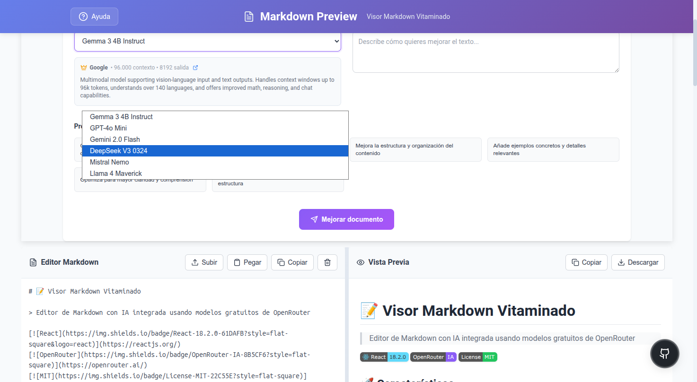
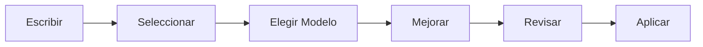

# 📝 Visor Markdown Vitaminado

> Editor de Markdown con IA integrada usando modelos gratuitos de OpenRouter

[](https://reactjs.org/)
[](https://openrouter.ai/)
[](LICENSE)

## 📸 Vista de la Aplicación



*Vista completa de la aplicación mostrando el editor de Markdown, vista previa en tiempo real y panel de IA con 6 modelos disponibles.*

## 🚀 Características

- **Editor en tiempo real** con vista previa instantánea
- **6 modelos de IA gratuitos** para mejora de contenido  
- **Mejora selectiva** de texto o documento completo
- **Prompts personalizados** y plantillas rápidas
- **Interfaz responsive** adaptativa
- **Historial de cambios** con deshacer/rehacer

## 🤖 Modelos Disponibles

| Modelo | Proveedor | Contexto | Especialidad |
|--------|-----------|----------|--------------|
| Gemma 3 4B | Google | 96K | Multimodal y razonamiento |
| GPT-4o Mini | OpenAI | 128K | Uso general avanzado |
| Gemini 2.0 Flash | Google | 1M | Velocidad y multimodal |
| DeepSeek V3 | DeepSeek | 163K | Tareas complejas |
| Mistral Nemo | Mistral | 131K | Multilingüe |
| Llama 4 Maverick | Meta | 1M | Visión y contexto largo |

## ⚡ Instalación Rápida

```bash
git clone https://github.com/686f6c61/visor-markdown-vitaminado.git
cd visor-markdown-vitaminado
npm install
cp .env.example .env.local
# Configurar REACT_APP_OPENROUTER_API_KEY en .env.local
npm start
```

## 🔧 Configuración

### Variables de Entorno

```env
REACT_APP_OPENROUTER_API_KEY=tu_api_key_aqui
REACT_APP_GOOGLE_GEMMA_3_4B_IT_ENABLED=true
REACT_APP_OPENAI_GPT_4O_MINI_ENABLED=true
REACT_APP_GOOGLE_GEMINI_2_0_FLASH_001_ENABLED=true
REACT_APP_DEEPSEEK_DEEPSEEK_CHAT_V3_0324_ENABLED=true
REACT_APP_MISTRALAI_MISTRAL_NEMO_ENABLED=true
REACT_APP_META_LLAMA_LLAMA_4_MAVERICK_ENABLED=true
```

### API Key de OpenRouter

1. Crear cuenta en [OpenRouter.ai](https://openrouter.ai/) (gratuita)
2. Generar API key en el dashboard
3. Configurar en `.env.local`

## 📖 Uso

### Editor
- Escribir directamente o arrastrar archivos `.md`
- Usar botones para cargar, pegar, copiar, deshacer, limpiar

### IA
- **Modo IA**: Panel completo con todos los modelos
- **Modo Preview**: Solo visualización sin IA
- **Mejora selectiva**: Seleccionar texto específico
- **Mejora completa**: Procesar todo el documento

### Prompts Rápidos
- Corregir gramática y mejorar fluidez
- Simplificar lenguaje manteniendo significado
- Mejorar estructura y organización
- Añadir ejemplos y detalles
- Optimizar para claridad
- Convertir a formato profesional

## 🏗️ Arquitectura

```
src/
├── components/
│   ├── MarkdownEditor.js    # Editor principal
│   ├── MarkdownPreview.js   # Vista previa
│   ├── AIPanel.js           # Panel de IA
│   ├── Header.js           # Cabecera
│   ├── Footer.js           # Pie de página
│   └── FloatingGitHub.js   # Botón GitHub
├── config/
│   └── models.js           # Configuración modelos
├── services/
│   └── openRouterService.js # API OpenRouter
└── App.js                  # Componente raíz
```

## 🛠️ Stack Tecnológico

- **React 18.2** - Framework principal
- **React Markdown** - Renderizado de Markdown
- **React Syntax Highlighter** - Highlighting de código
- **Lucide React** - Iconografía
- **Axios** - Cliente HTTP
- **OpenRouter API** - Modelos de IA

## 🔄 Flujo de Trabajo



## 📱 Responsive

- **Desktop**: Vista de 3 columnas (Editor | Preview | IA)
- **Tablet**: Vista apilada con navegación
- **Mobile**: Vista única con pestañas

## 🤝 Contribuir

1. Fork del repositorio
2. Crear rama feature (`git checkout -b feature/nueva-funcionalidad`)
3. Commit cambios (`git commit -m 'Añadir nueva funcionalidad'`)
4. Push a la rama (`git push origin feature/nueva-funcionalidad`)
5. Crear Pull Request

## 📄 Licencia

MIT License - ver [LICENSE](LICENSE) para detalles.

---

**Desarrollado con React + OpenRouter** | [Repositorio](https://github.com/686f6c61/visor-markdown-vitaminado)

