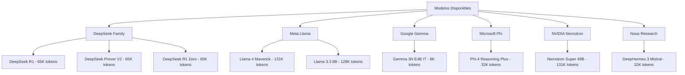
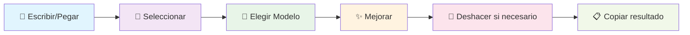
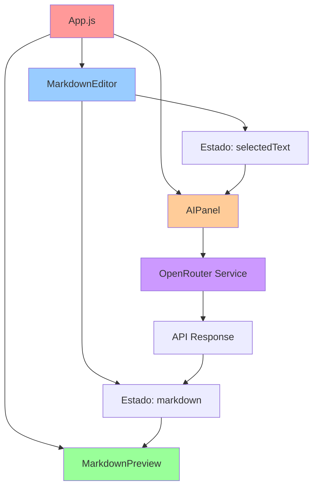

# 🚀 Visor Markdown Vitaminado ⚡

> **El editor de Markdown más potente con IA integrada** - Transforma tus documentos con inteligencia artificial

[](https://reactjs.org/)
[](https://openrouter.ai/)
[](LICENSE)
[](https://github.com/686f6c61)

---

## 📋 Tabla de Contenidos

- [✨ Características](#-características)
- [🤖 Modelos de IA](#-modelos-de-ia-disponibles)
- [🛠️ Instalación](#️-instalación)
- [🔑 Configuración](#-configuración-de-openrouter)
- [📖 Uso](#-uso)
- [🏗️ Arquitectura](#️-arquitectura-del-proyecto)
- [🎨 Tecnologías](#-tecnologías-utilizadas)
- [📱 Capturas](#-capturas-de-pantalla)
- [🤝 Contribuir](#-contribuir)
- [📝 Licencia](#-licencia)
- [👨‍💻 Autor](#-autor)

---

## ✨ Características

### 🎯 **Funcionalidades Principales**

| Característica | Descripción | Estado |
|---|---|---|
| 📝 **Editor Avanzado** | Editor con syntax highlighting y autocompletado | ✅ Implementado |
| 👁️ **Vista Previa** | Renderizado en tiempo real con GitHub styling | ✅ Implementado |
| 🤖 **IA Vitaminada** | 10 modelos de IA gratuitos para mejorar contenido | ✅ Implementado |
| 🎯 **Mejora Selectiva** | Mejora solo el texto seleccionado | ✅ Implementado |
| 📱 **Responsive** | Diseño adaptativo para todos los dispositivos | ✅ Implementado |
| 🔄 **Historial** | Sistema de deshacer/rehacer cambios | ✅ Implementado |
| 📋 **Clipboard** | Copiar y pegar con un clic | ✅ Implementado |

### 🚀 **Características Avanzadas**

- [x] **Drag & Drop** - Arrastra archivos `.md` directamente
- [x] **Prompts Rápidos** - 5 prompts predefinidos para mejoras comunes
- [x] **Enlaces Directos** - Acceso directo a información de modelos en OpenRouter
- [x] **Modo Oscuro** - Interfaz adaptable (próximamente)
- [x] **Exportación** - Guarda como `.md` o `.html` (próximamente)

---

## 🤖 Modelos de IA Disponibles

> **¡Todos los modelos son 100% GRATUITOS!** ⚡

### 🏆 **Modelos de Alto Rendimiento**



### 📊 **Comparativa de Modelos**

| Modelo | Proveedor | Tokens | Especialidad | Velocidad |
|--------|-----------|--------|--------------|-----------|
| 🧠 **DeepSeek R1** | DeepSeek | 65,536 | Razonamiento avanzado | ⚡⚡⚡ |
| 🦙 **Llama 4 Maverick** | Meta | 131,072 | Uso general | ⚡⚡⚡⚡ |
| 🔬 **Phi-4 Reasoning Plus** | Microsoft | 32,768 | Matemáticas y ciencia | ⚡⚡⚡ |
| 🚀 **Nemotron Super 49B** | NVIDIA | 131,072 | Alta capacidad | ⚡⚡ |
| 💎 **DeepHermes 3** | Nous Research | 32,768 | Razonamiento profundo | ⚡⚡⚡ |

---

## 🛠️ Instalación

### 📋 **Requisitos Previos**

- **Node.js** >= 16.0.0
- **npm** >= 8.0.0
- **Cuenta OpenRouter** (gratuita)

### 🚀 **Instalación Rápida**

```bash
# 1. Clona el repositorio
git clone https://github.com/686f6c61/visor-markdown-openrouter-models.git
cd visor-markdown-openrouter-models

# 2. Instala dependencias
npm install

# 3. Configura variables de entorno
cp env.example .env

# 4. Edita tu API key
nano .env  # o tu editor favorito

# 5. ¡Lanza la aplicación!
npm start
```

### 🐳 **Docker (Opcional)**

```dockerfile
# Dockerfile incluido para deployment
FROM node:18-alpine
WORKDIR /app
COPY package*.json ./
RUN npm ci --only=production
COPY . .
RUN npm run build
EXPOSE 3000
CMD ["npm", "start"]
```

---

## 🔑 Configuración de OpenRouter

### 1️⃣ **Obtener API Key**

1. Visita [OpenRouter.ai](https://openrouter.ai/)
2. Crea una cuenta gratuita
3. Ve a **API Keys** en tu dashboard
4. Genera una nueva API key

### 2️⃣ **Configurar Variables de Entorno**

```env
# 🔐 API Configuration
REACT_APP_OPENROUTER_API_KEY=sk-or-v1-tu-api-key-aqui

# 🤖 Model Configuration (true/false)
REACT_APP_ENABLE_DEEPSEEK_R1=true
REACT_APP_ENABLE_QWEN3_30B=true
REACT_APP_ENABLE_LLAMA_4_MAVERICK=true
REACT_APP_ENABLE_GEMMA_3N=true
REACT_APP_ENABLE_LLAMA_33_8B=true
REACT_APP_ENABLE_DEEPHERMES_3=true
REACT_APP_ENABLE_PHI_4=true
REACT_APP_ENABLE_DEEPSEEK_PROVER=true
REACT_APP_ENABLE_NEMOTRON_49B=true
REACT_APP_ENABLE_DEEPSEEK_R1_ZERO=true

# 🌐 App Configuration
REACT_APP_GITHUB_REPO=https://github.com/686f6c61/visor-markdown-openrouter-models
REACT_APP_GITHUB_USER=686f6c61
```

### 3️⃣ **Verificar Configuración**

```bash
# Verifica que todo funcione
npm run build
npm start
```

---

## 📖 Uso

### 🎯 **Flujo de Trabajo Básico**



### 📝 **Editor de Markdown**

#### **Métodos de Entrada**
- ✍️ **Escritura directa** en el editor
- 📁 **Arrastrar archivos** `.md` al área del editor
- 📋 **Pegar** desde portapapeles con un clic
- ⬆️ **Subir archivos** usando el botón de carga

#### **Controles del Editor**
| Botón | Función | Disponibilidad |
|-------|---------|----------------|
| ⬆️ **Subir** | Cargar archivo .md | Siempre |
| 📋 **Pegar** | Pegar desde portapapeles | Siempre |
| 📄 **Copiar** | Copiar contenido | Solo con texto |
| ↩️ **Deshacer** | Revertir último cambio | Solo con historial |
| 🗑️ **Limpiar** | Borrar todo el contenido | Solo con texto |

### 🤖 **Panel de IA**

#### **Selección de Modelo**
1. **Elige un modelo** de la lista desplegable
2. **Ve información detallada** (proveedor, tokens, descripción)
3. **Accede a OpenRouter** con el enlace directo para más detalles

#### **Tipos de Mejora**

> **💡 Tip:** Selecciona texto específico para mejoras parciales

##### 🎯 **Mejora Selectiva**
```markdown
Selecciona este párrafo específico que quieres mejorar
y la IA solo trabajará en esta sección.
```

##### 📄 **Mejora Completa**
Sin selección de texto, la IA mejorará todo el documento.

#### **Prompts Disponibles**

| Prompt Rápido | Descripción | Uso Recomendado |
|---------------|-------------|-----------------|
| 🎯 **Claridad y estructura** | Mejora organización | Documentos técnicos |
| ✏️ **Corrección gramatical** | Corrige errores | Textos formales |
| 📚 **Más detalles** | Añade ejemplos | Tutoriales |
| 🔤 **Simplificar lenguaje** | Hace más accesible | Documentación |
| 📐 **Mejorar formato** | Optimiza estructura | Cualquier documento |

---

## 🏗️ Arquitectura del Proyecto

### 📁 **Estructura de Directorios**

```
src/
├── 🎨 components/           # Componentes React
│   ├── 📄 Header.js        # Cabecera con navegación
│   ├── ✏️ MarkdownEditor.js # Editor principal
│   ├── 👁️ MarkdownPreview.js # Vista previa
│   ├── 🤖 AIPanel.js       # Panel de IA
│   ├── 🦶 Footer.js        # Pie de página
│   └── 🔗 FloatingGitHub.js # Botón flotante
├── ⚙️ config/
│   └── 🤖 models.js        # Configuración de modelos
├── 🔧 services/
│   └── 🌐 openRouterService.js # API de OpenRouter
├── 🎨 styles/              # Estilos globales
├── 📱 App.js               # Componente raíz
└── 🚀 index.js             # Punto de entrada
```

### 🔄 **Flujo de Datos**



---

## 🎨 Tecnologías Utilizadas

### 🏗️ **Frontend**

| Tecnología | Versión | Propósito |
|------------|---------|-----------|
| ⚛️ **React** | 18.2.0 | Framework principal |
| 📝 **React Markdown** | ^8.0.7 | Renderizado de Markdown |
| 🎨 **React Syntax Highlighter** | ^15.5.0 | Highlighting de código |
| 🎯 **Lucide React** | ^0.263.1 | Iconos modernos |
| 🌐 **Axios** | ^1.4.0 | Cliente HTTP |

### 🔧 **Herramientas de Desarrollo**

- 🛠️ **Create React App** - Configuración base
- 📦 **npm** - Gestión de paquetes
- 🎨 **CSS3** - Estilos personalizados
- 🔍 **ESLint** - Linting de código

### 🤖 **Servicios Externos**

- 🌐 **OpenRouter API** - Acceso a modelos de IA
- 📚 **GitHub** - Repositorio y documentación

---

## 📱 Capturas de Pantalla

### 🖥️ **Vista Desktop**

```
┌─────────────────────────────────────────────────────────────┐
│ 🚀 Visor Markdown Vitaminado                    🔗 GitHub   │
├─────────────────────────────────────────────────────────────┤
│                                                             │
│  📝 Editor              │  👁️ Vista Previa  │  🤖 IA Panel │
│  ┌─────────────────┐   │  ┌──────────────┐  │  ┌─────────┐ │
│  │ # Mi Documento  │   │  │ Mi Documento │  │  │ Modelos │ │
│  │                 │   │  │              │  │  │ ⚡ Gratis│ │
│  │ Contenido...    │   │  │ Contenido... │  │  │ Prompts │ │
│  │                 │   │  │              │  │  │ ✨ Mejorar│ │
│  └─────────────────┘   │  └──────────────┘  │  └─────────┘ │
│                                                             │
├─────────────────────────────────────────────────────────────┤
│ ❤️ Hecho con amor por 686f6c61 • ⚡ React + OpenRouter     │
└─────────────────────────────────────────────────────────────┘
```

### 📱 **Vista Mobile**

```
┌─────────────────────┐
│ 🚀 Visor MD    🔗   │
├─────────────────────┤
│                     │
│  📝 Editor          │
│  ┌─────────────────┐│
│  │ # Documento     ││
│  │ Contenido...    ││
│  └─────────────────┘│
│                     │
│  👁️ Vista Previa    │
│  ┌─────────────────┐│
│  │ Documento       ││
│  │ Renderizado...  ││
│  └─────────────────┘│
│                     │
│  🤖 IA Panel        │
│  ┌─────────────────┐│
│  │ Modelos ⚡      ││
│  │ Prompts ✨      ││
│  └─────────────────┘│
│                     │
├─────────────────────┤
│ ❤️ 686f6c61 • ⚡ AI │
└─────────────────────┘
```

---

## 🤝 Contribuir

### 🎯 **Cómo Contribuir**

1. **🍴 Fork** el proyecto
2. **🌿 Crea** una rama para tu feature
   ```bash
   git checkout -b feature/AmazingFeature
   ```
3. **💾 Commit** tus cambios
   ```bash
   git commit -m 'Add some AmazingFeature'
   ```
4. **📤 Push** a la rama
   ```bash
   git push origin feature/AmazingFeature
   ```
5. **🔄 Abre** un Pull Request

### 🐛 **Reportar Bugs**

Usa las [GitHub Issues](https://github.com/686f6c61/visor-markdown-openrouter-models/issues) con:

- 📝 **Descripción clara** del problema
- 🔄 **Pasos para reproducir**
- 🖥️ **Información del sistema**
- 📸 **Capturas de pantalla** si aplica

### 💡 **Sugerir Features**

¡Nos encantan las ideas nuevas! Abre un issue con:

- 🎯 **Descripción de la feature**
- 🤔 **Por qué sería útil**
- 💭 **Cómo debería funcionar**

---

## 📝 Licencia

Este proyecto está bajo la **Licencia MIT**. Ver el archivo [LICENSE](LICENSE) para más detalles.

```
MIT License

Copyright (c) 2025 686f6c61

Permission is hereby granted, free of charge, to any person obtaining a copy
of this software and associated documentation files (the "Software"), to deal
in the Software without restriction, including without limitation the rights
to use, copy, modify, merge, publish, distribute, sublicense, and/or sell
copies of the Software, and to permit persons to whom the Software is
furnished to do so, subject to the following conditions:

The above copyright notice and this permission notice shall be included in all
copies or substantial portions of the Software.
```

---

## 👨‍💻 Autor

<div align="center">

### **[686f6c61](https://github.com/686f6c61)**

[](https://github.com/686f6c61)
[](mailto:contact@example.com)

> *"Creando herramientas que hacen la vida más fácil, una línea de código a la vez"*

</div>

---

## 🌟 Agradecimientos

- 🤖 **OpenRouter** - Por proporcionar acceso gratuito a modelos de IA
- ⚛️ **React Team** - Por el increíble framework
- 🎨 **Lucide** - Por los hermosos iconos
- 🌍 **Open Source Community** - Por inspirar y compartir

---

<div align="center">

### ⭐ ¡Dale una estrella si te gusta el proyecto! ⭐

[](https://github.com/686f6c61/visor-markdown-openrouter-models/stargazers)
[](https://github.com/686f6c61/visor-markdown-openrouter-models/network/members)
[](https://github.com/686f6c61/visor-markdown-openrouter-models/issues)

---

**¿Te gusta el proyecto? ¡Compártelo!**

[](https://twitter.com/intent/tweet?text=¡Mira%20este%20increíble%20editor%20de%20Markdown%20con%20IA!&url=https://github.com/686f6c61/visor-markdown-openrouter-models)
[](https://www.linkedin.com/sharing/share-offsite/?url=https://github.com/686f6c61/visor-markdown-openrouter-models)

</div>

---

<div align="center">
<sub>Hecho con ❤️ por <a href="https://github.com/686f6c61">686f6c61</a> • Desarrollado con ⚡ React + OpenRouter</sub>
</div> 